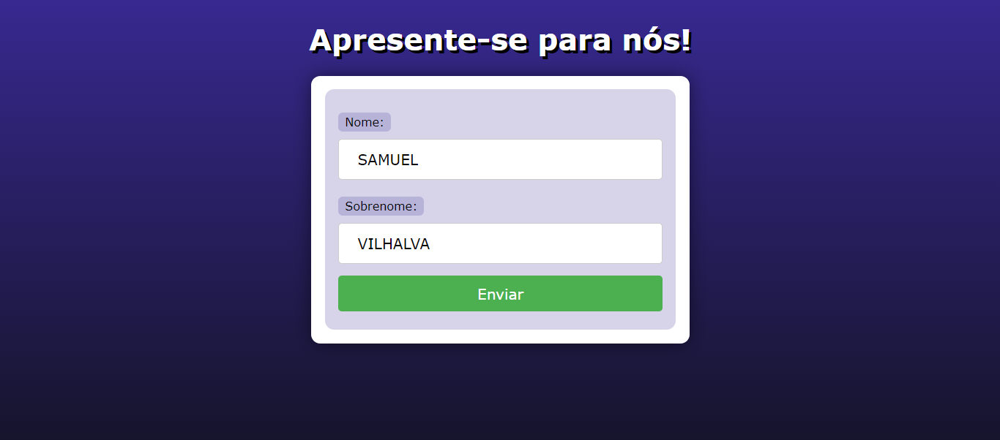
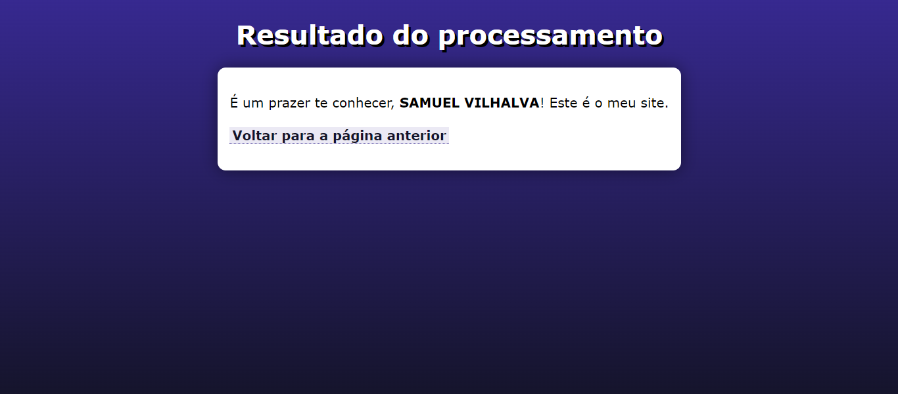

# APRESENTACAO EM PHP
👨‍🏫PROJETO CRIADO PARA O CURSO DE PHP DO CURSO EM VIDEO.

 <br>
 <br>

## DESCRIÇÃO:
A aplicação "Apresentação em PHP" consiste em duas páginas interligadas: uma página de formulário para os usuários se apresentarem e outra página para processar e exibir as informações submetidas pelo usuário.

## EXECUTANDO O PROJETO:
1. **Executando o Aplicativo com Apache:**
   - Coloque os arquivos em um servidor web compatível com PHP (por exemplo, XAMPP, WAMP, LAMP).
   - Acesse o formulário no navegador visitando [http://localhost/CODIGO/index.html](http://localhost/CODIGO/index.html).

2. **Executando o Aplicativo com `php.exe`:**
   - Alternativamente, você pode iniciar o servidor diretamente no diretório `./CODIGO` com o comando abaixo:
   ```bash
   php -S localhost:8080
   ```
   - Em seguida, acesse o formulário no navegador através do endereço: [http://localhost:8080/index.html](http://localhost:8080/index.html).

3. **Interagir com o Projeto:**
   1. **Preencher o Formulário:**
      - Acesse a página `index.html` pelo navegador.
      - Preencha os campos "Nome" e "Sobrenome" no formulário apresentado.

   2. **Enviar os Dados:**
      - Após preencher os campos, clique no botão "Enviar".
      - Os dados inseridos serão enviados para a página `cad.php` para processamento.

   3. **Visualizar o Resultado:**
      - Após o envio, você será redirecionado para a página `cad.php`, onde o nome e sobrenome fornecidos serão processados.
      - O resultado será exibido na página, saudando o usuário pelo nome e sobrenome fornecidos.

   4. **Voltar para a Página Anterior:**
      - Na página `cad.php`, você terá a opção de voltar para a página anterior clicando no link fornecido.

   5. **Interagir com o Código:**
      - Você pode modificar o estilo da página alterando o arquivo `style.css`.
      - Também é possível personalizar o processamento dos dados em `cad.php`, adicionando mais campos ao formulário e manipulando os dados recebidos conforme necessário.
      
## CREDITOS:
- [PROJETO CRIADO PARA O CURSO DE PHP](https://github.com/VILHALVA/CURSO-DE-PHP)
- [PROJETO FEITO PELO VILHALVA](https://github.com/VILHALVA)


